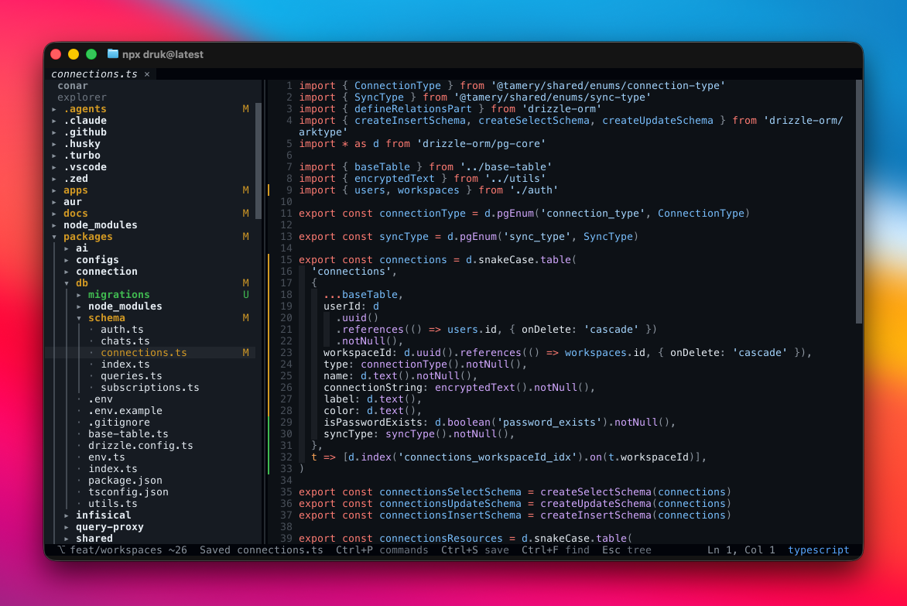

# dune

A terminal code editor with a file tree, tabs, search, git marks, themes, vim mode, and
tree-sitter highlighting for 30+ languages.



## Status

`dune` is a Bun and TypeScript TUI built on OpenTUI. The app runs from source with Bun
and ships as a self-contained executable for macOS, Linux, and Windows.

## Quick Start

```bash
bun install
bun run start .
```

Build a local binary:

```bash
bun run build
./dist/*/dune .
```

Run the full local gate:

```bash
bun run check
```

## Installation

Install from a release script:

```bash
curl -fsSL https://raw.githubusercontent.com/dotbrains/dune/main/install | bash
```

Or install the npm shim once releases are configured:

```bash
npm install -g dune
bun add -g dune
```

The shim downloads the matching binary from the GitHub release. Set `DUNE_DOWNLOAD_BASE`
to use a mirror.

## Usage

```bash
dune                  # current directory
dune ./my-app         # directory
dune src/main.ts      # single file
dune src/main.ts:42   # open at line 42
dune update           # upgrade this installation
```

`npx dune` and `bunx dune` work once the package is published.

## Shortcuts

| Key                 | Action                |
| ------------------- | --------------------- |
| `Ctrl+P`            | Command palette       |
| `Ctrl+K`            | Peek active shortcuts |
| `Ctrl+O`            | Open a file           |
| `Ctrl+T`            | Switch tabs           |
| `Ctrl+S`            | Save                  |
| `Ctrl+F`            | Find in file          |
| `Ctrl+R`            | Search project        |
| `Ctrl+G`            | Go to line            |
| `Ctrl+N`            | New file              |
| `Ctrl+W`            | Close tab             |
| `Ctrl+B`            | Toggle sidebar        |
| `Ctrl+Q`            | Quit                  |
| `Ctrl+Z` / `Ctrl+Y` | Undo / redo           |

The file tree supports keyboard and mouse navigation, preview tabs, bulk moves and
copies, and guarded deletes. `Ctrl+C` copies when text is selected and quits when it is
not, so unsaved work is not thrown away.

## Project Map

| Path             | Purpose                                                             |
| ---------------- | ------------------------------------------------------------------- |
| `src/app/`       | Application state, command dispatch, and root TUI composition       |
| `src/ui/`        | Reusable terminal UI components                                     |
| `src/editor/`    | Text buffer, edits, history, selection, windowing, and vim logic    |
| `src/core/`      | CLI parsing, filesystem, config, git, updates, sessions, and search |
| `src/languages/` | Tree-sitter grammar registry, queries, and highlighting             |
| `src/themes/`    | Theme definitions                                                   |
| `bin/`           | npm launcher, install-time binary fetcher, and platform detection   |
| `scripts/`       | Release archive and Homebrew formula generation                     |
| `test/`          | Bun unit and off-screen TUI tests                                   |

## Development

Use Bun for all installs and scripts:

```bash
bun install
bun run check-types
bun run lint
bun run format:check
bun run test
```

Optional reproducible shell:

```bash
flox activate
```

Optional commit hooks:

```bash
pre-commit install
pre-commit run --all-files
```

More detail lives in:

- [Architecture](ARCHITECTURE.md)
- [Development](docs/development.md)
- [Testing](docs/testing.md)
- [CI](docs/ci.md)
- [Releasing](docs/releasing.md)

## License

This repository uses the PolyForm Shield License 1.0.0. See [LICENSE](LICENSE).
