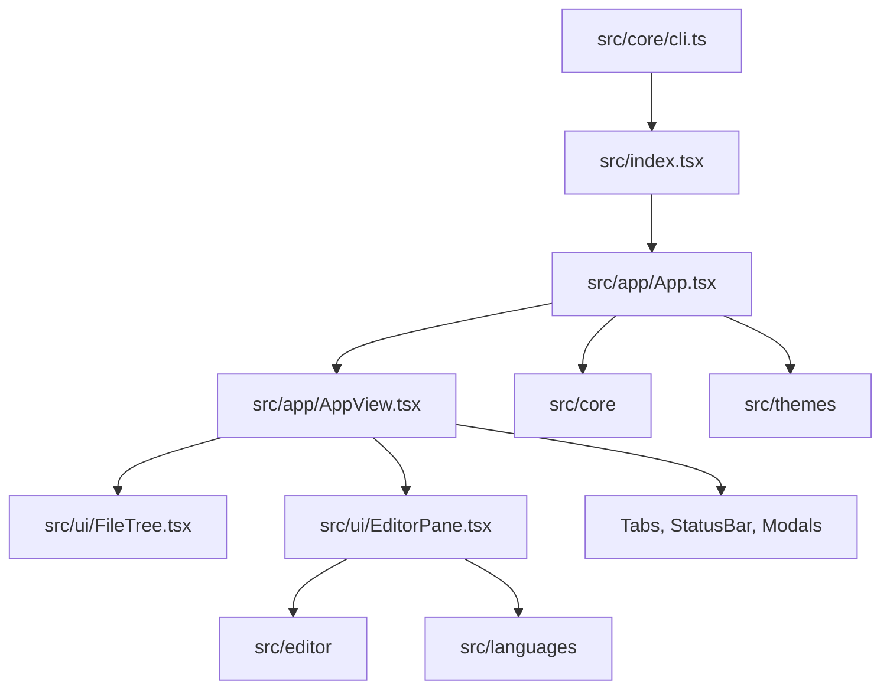
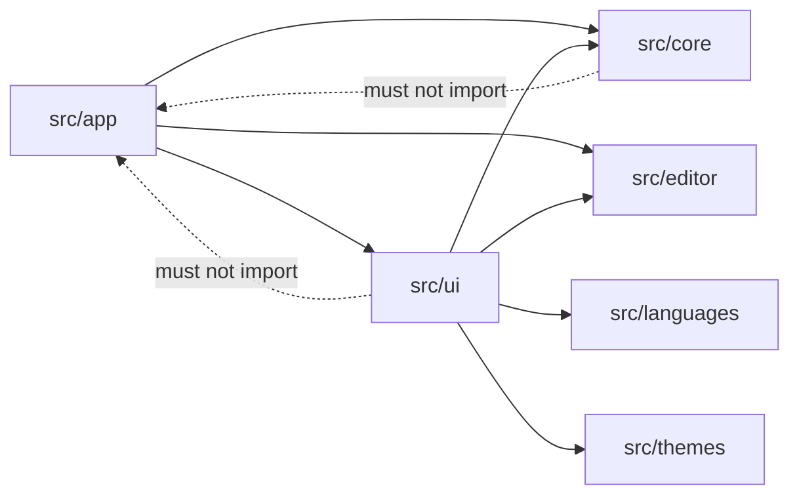
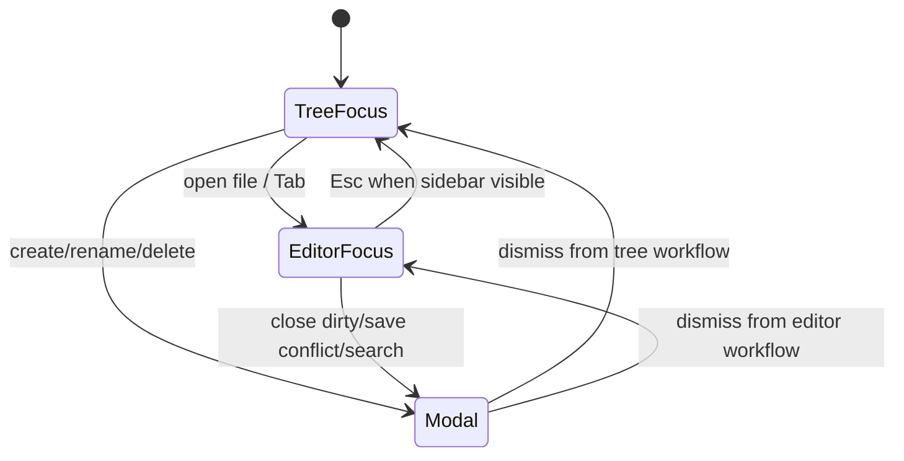
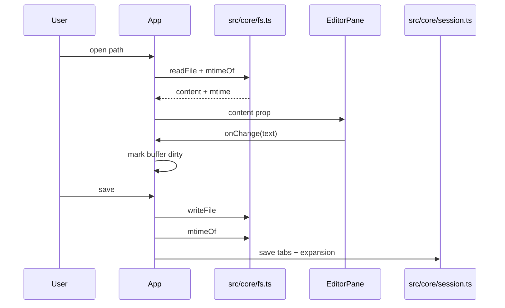
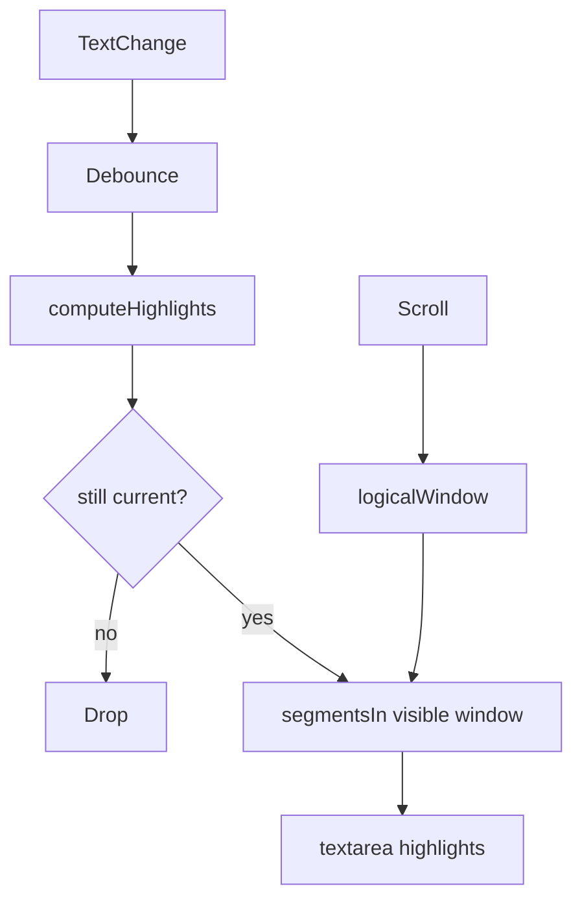

# Architecture

`dune` is a terminal editor implemented as a Solid application rendered by OpenTUI. The codebase is intentionally organized around runtime responsibilities rather than UI pages: the terminal is a single long-lived surface, and most behavior is a coordination problem between buffers, files, tree state, search, git metadata, and keyboard input.

## Runtime Shape

`src/app/App.tsx` owns process-level coordination: open buffers, tabs, tree expansion, dirty state, conflict prompts, global keybindings, update checks, git refresh cadence, and session persistence. It deliberately stays above `src/ui` and passes state down through props.

`src/app/AppView.tsx` is render-only. It receives already-derived values and callbacks from `App.tsx` and composes the terminal surface. This split keeps the root state machine below the file-size budget while keeping rendering readable.

`src/ui/EditorPane.tsx` owns the OpenTUI textarea integration. It handles text entry, selection, clipboard integration, cursor reporting, undo/redo, vim command dispatch, syntax highlight windows, editor scrollbar behavior, and change-track rendering.

## Dependency Rule

Feature folders must not import from `src/app`. If a UI component needs a new behavior, pass a callback from `App.tsx` or move the behavior into a lower-level feature module.

## State Ownership

The app has one active focus owner: tree or editor. Overlays temporarily block both. `overlay()` in `App.tsx` is the central guard that prevents global keyboard handlers and editor handlers from both acting on the same key.

## File and Buffer Lifecycle

Buffers are keyed by absolute path. Moves and renames must remap every path-bearing structure: buffers, tabs, active path, preview path, selection, and expanded folders.

## Highlighting Strategy

Syntax parsing can be much more expensive than terminal painting. `EditorPane` parses the file, segments only the visible logical window plus overscan, and caches segmented lines. When text, filetype, theme, tab size, or wrapping changes, stale highlight state is dropped and rebuilt.

## LOC Budget Boundaries

The enforced source budget is 999 lines per tracked source/doc/script/workflow file. Current large responsibilities are split as follows:

| Responsibility                    | Module                    |
| --------------------------------- | ------------------------- |
| App state/effects/global handlers | `src/app/App.tsx`         |
| App render composition            | `src/app/AppView.tsx`     |
| App startup restoration           | `src/app/restore.ts`      |
| Prompt confirmation copy          | `src/app/confirmation.ts` |
| Prompt title metadata             | `src/app/prompts.ts`      |
| Shared app types                  | `src/app/types.ts`        |
| Editor renderable integration     | `src/ui/EditorPane.tsx`   |

The budget is enforced by `bun run budget:file-sizes` and `bun run budget:flat-dirs` locally, in pre-commit, and in CI.
