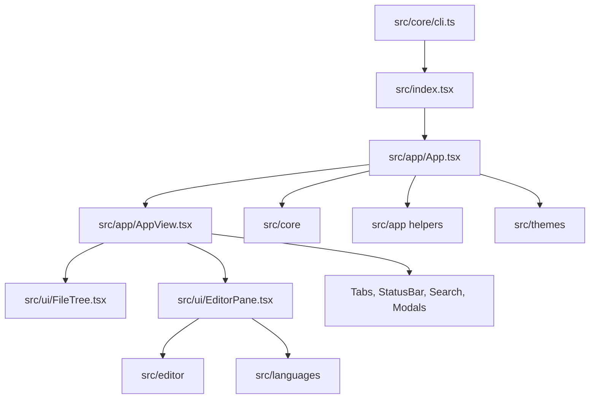
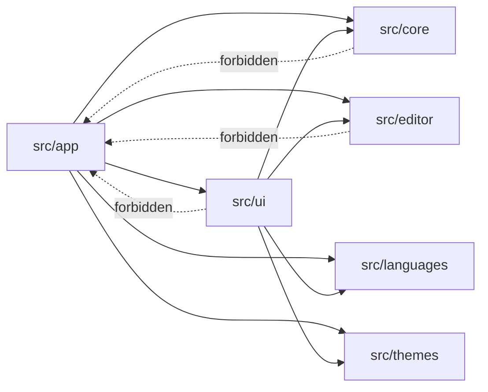
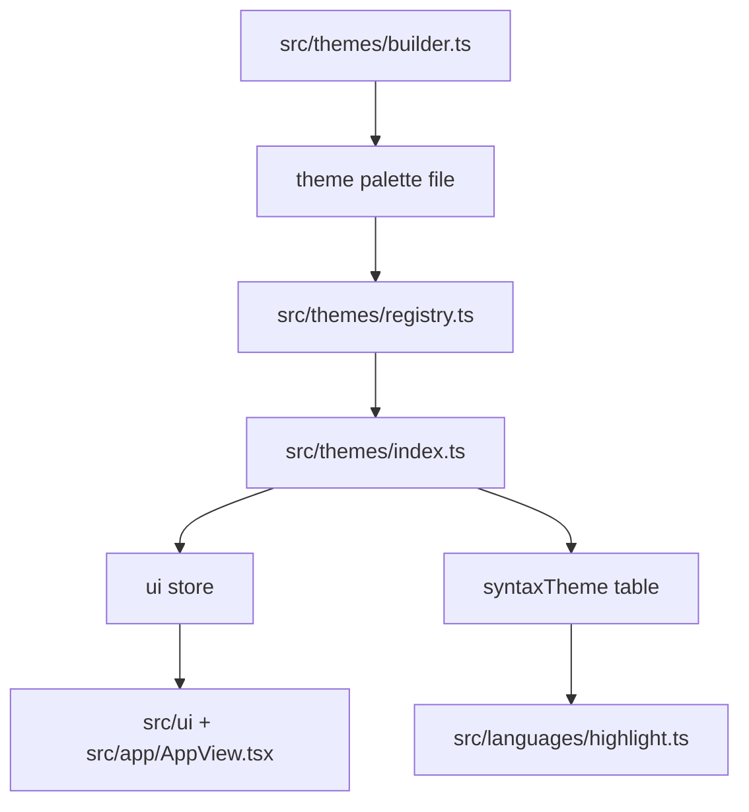
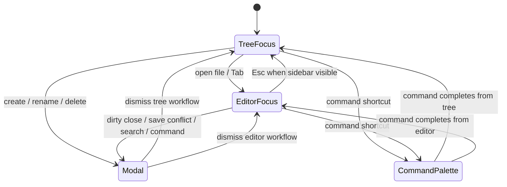
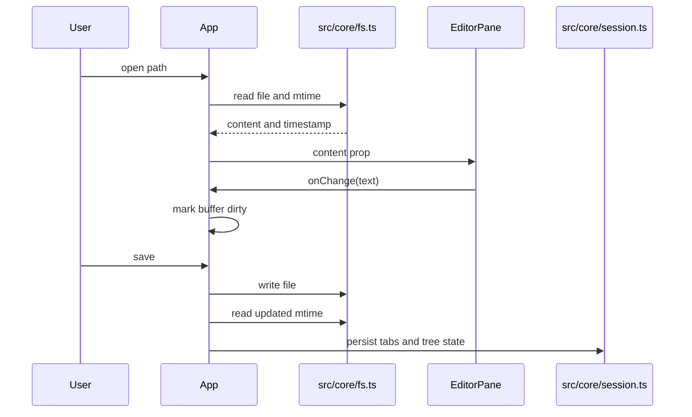
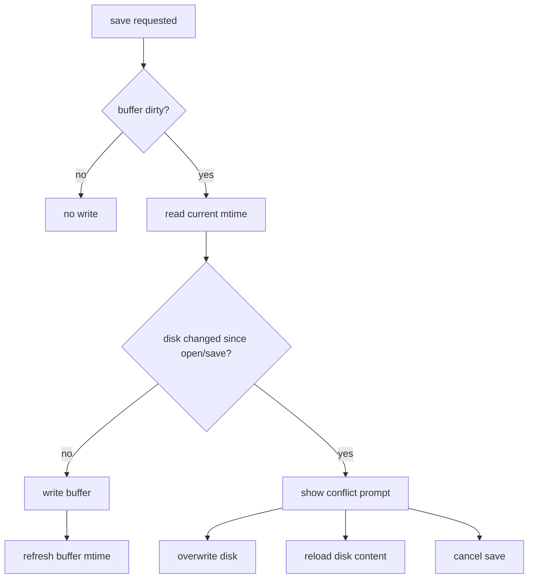
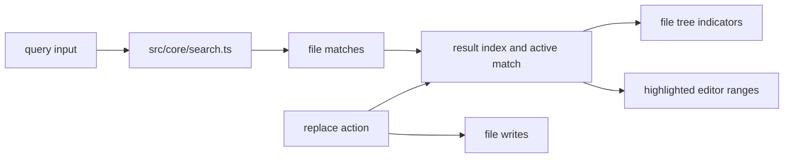
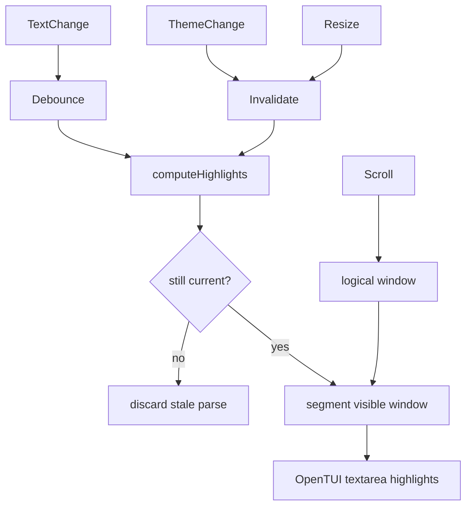
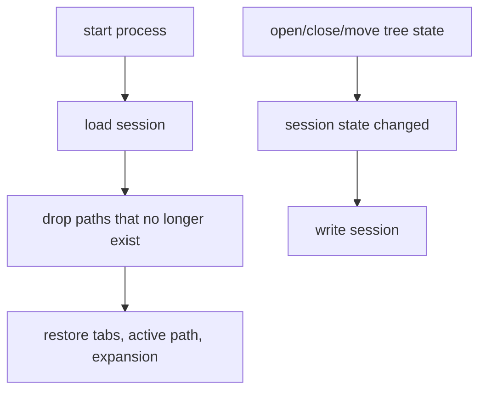

# Architecture

`dune` is a terminal code editor built as a Solid application rendered through OpenTUI. It is not organized like a browser application with multiple pages. The process owns one long-lived terminal surface, and most of the engineering work is about keeping editor state, file-system state, tree state, git metadata, search state, and keyboard focus in sync without letting any one module become an untestable control center.

This document describes the runtime shape, ownership boundaries, and maintenance rules that should guide future changes.

## Runtime Shape

The CLI parses process arguments and identifies the starting workspace. `src/index.tsx` creates the terminal renderer and mounts the Solid app. From there, `src/app/App.tsx` becomes the process-level coordinator. It owns the durable state that has to survive across components: open buffers, active tab, preview path, dirty markers, expanded directories, file selections, search state, prompt state, update banners, and session persistence.

`src/app/AppView.tsx` is intentionally render-oriented. It receives derived values and callbacks from `App.tsx` and composes the terminal surface. It should not grow its own business rules. If a change requires process-level decisions, keep those decisions in `App.tsx` or in a focused helper under `src/app`.

`src/ui/EditorPane.tsx` owns the OpenTUI textarea integration. It is the boundary where editor behavior meets terminal rendering: cursor movement, scroll windows, selections, clipboard operations, textarea mutation, syntax highlight painting, vim command dispatch, undo/redo wiring, and editor-specific keyboard handling.

## Source Layout

| Directory       | Responsibility                                                                             | Notes                                                                                      |
| --------------- | ------------------------------------------------------------------------------------------ | ------------------------------------------------------------------------------------------ |
| `src/app`       | Application state machine and app-level helper modules                                     | This layer may coordinate lower-level modules, but lower-level modules must not import it. |
| `src/core`      | Process, filesystem, git, config, search, session, update, and release-adjacent primitives | Keep these functions UI-agnostic and explicit about IO errors.                             |
| `src/editor`    | Pure or mostly pure editor operations                                                      | Prefer this folder for line math, history, typing, vim, and change-map logic.              |
| `src/ui`        | OpenTUI/Solid components                                                                   | Components should receive data and callbacks rather than reaching up into app state.       |
| `src/languages` | Tree-sitter grammar and query integration                                                  | Changes here affect highlight behavior and parser cost.                                    |
| `src/themes`    | Theme palettes, shared theme builders, runtime theme state, and the registry               | Use `builder.ts` for semantic palettes; keep one-off ports as small standalone files.      |
| `test`          | Behavior and integration tests                                                             | Tests are intentionally flat so individual behavior surfaces are easy to run.              |
| `scripts`       | Repository automation                                                                      | Budget, release, and packaging scripts live here.                                          |

## Dependency Rule

## Theme System

Themes have three layers:

`registry.ts` is the catalog. Adding an entry there makes the theme available to config
validation and to the command palette. `index.ts` owns mutable runtime state: `ui` is a
Solid store for chrome colors, while `syntaxTheme` is an imperative table rebuilt when
the active theme changes.

Prefer `defineTheme()` from `builder.ts` when a palette can be described with semantic
roles such as `bg`, `accent`, `keyword`, `string`, and `gitAdded`. It fills every chrome
key and syntax group consistently. Keep hand-written theme objects only when a port needs
capture-specific choices that the semantic roles would hide.

The rule is simple: lower-level modules must not import from `src/app`. If a component needs a new behavior, add a callback prop from the app layer or move the reusable operation into `src/core`, `src/editor`, or a local helper module. This keeps app state visible at the top while preserving testable lower-level functions.

Avoid adding convenience imports that make this rule blurry. A short explicit prop chain is easier to maintain than a hidden import from the app coordinator.

## Focus Ownership

The app has one active focus owner: the file tree or the editor. Modal overlays temporarily suspend both. Global keybindings are guarded by the overlay state so the editor and app do not both react to the same keypress.

When adding a new overlay, decide which focus owner should be restored on dismiss. Do not infer focus from the visible component tree alone. A modal can be launched from either the tree or editor, and restoring the wrong owner makes keyboard behavior feel inconsistent.

## File And Buffer Lifecycle

Buffers are keyed by absolute path. Every operation that changes a path has to update all path-bearing state together: buffers, tabs, active path, preview path, tree selection, expanded directories, git status cache, dirty markers, and session data.

The editor assumes that an opened buffer belongs to a stable absolute path. Rename and move workflows must remap paths instead of closing and reopening by accident. Closing and reopening loses undo history, preview state, cursor position, and conflict metadata.

## Dirty And Conflict Handling

Dirty state is local to the process. File conflicts are detected by comparing the saved mtime known to the buffer with the current mtime on disk before write operations. The app should prefer explicit user choices over silent overwrites.

Any new file-writing feature should fit this shape unless it is intentionally operating on files that are not open in the editor. Bulk operations need special care because one operation can affect many buffers.

## Search And Replace

Search is split between app-level coordination and reusable search primitives. The app tracks the current query, result selection, replace prompt, and target scope. Core search code should remain independent from terminal rendering so it can be tested without OpenTUI.

Search UI changes should account for three states: no query, query with no results, and query with selected results. Replace changes also need to preserve dirty-state semantics for open buffers.

## Highlighting Strategy

Syntax parsing and segmenting can be more expensive than terminal painting. `EditorPane` parses the current file, segments only the visible logical window plus overscan, and caches segmented lines. When text, filetype, theme, tab size, wrapping, or viewport size changes, stale highlight state is dropped and rebuilt.

The stale-check is important. A parse result can finish after the user has typed more text, changed tabs, or switched themes. Applying that result would paint incorrect ranges into the editor.

## Session Persistence

Session persistence lives below the app layer in `src/core/session.ts`, but `App.tsx` decides when persistence is meaningful. The session should store durable user context, not transient render details.

Avoid persisting values that are derived from other state. Derived values become migration liabilities and tend to go stale after file operations.

## Error Handling

Dune should surface recoverable errors through prompts, status text, or explicit command results. Silent failures are appropriate only for non-critical best-effort decoration, such as a failed background update check. Filesystem writes, destructive actions, session migration failures, and release scripts should fail loudly enough for a user or CI run to act on them.

Prefer returning structured results from lower-level modules over throwing through UI code. Throwing is acceptable for programmer errors and startup failures, but user-facing workflows should usually have enough context to explain what failed.

## LOC Budget Boundaries

The enforced source budget is 500 lines per tracked source, docs, script, workflow, JSON, TOML, or shell file. This is a hard maintenance constraint, not just a CI preference.

| Responsibility                      | Module                                                             |
| ----------------------------------- | ------------------------------------------------------------------ |
| App state, effects, global handlers | `src/app/App.tsx`                                                  |
| App render composition              | `src/app/AppView.tsx`                                              |
| App startup restoration             | `src/app/restore.ts`                                               |
| Prompt confirmation copy            | `src/app/confirmation.ts`                                          |
| Prompt title metadata               | `src/app/prompts.ts`                                               |
| Shared app types                    | `src/app/types.ts`                                                 |
| Editor renderable integration       | `src/ui/EditorPane.tsx`                                            |
| File-size and directory budgets     | `scripts/check-file-sizes.ts`, `scripts/check-flat-directories.ts` |

When a file approaches the budget, extract along an existing responsibility boundary. Do not split by arbitrary line ranges. A good extraction has a name that describes the behavior it owns and leaves both the source and extracted file easier to review.

## Change Checklist

Before merging architecture-significant changes, verify:

| Question                                                        | Why it matters                                                                           |
| --------------------------------------------------------------- | ---------------------------------------------------------------------------------------- |
| Did any lower-level module import from `src/app`?               | That reverses the dependency graph and makes tests harder.                               |
| Did a path-changing operation update all path-bearing state?    | Missing one structure causes stale tabs, stale dirty markers, or broken session restore. |
| Did an overlay restore the correct focus owner?                 | Keyboard behavior depends on explicit focus ownership.                                   |
| Did a file-writing operation respect conflict detection?        | Silent overwrites are data loss.                                                         |
| Did the change stay under file-size and flat-directory budgets? | CI enforces this and the project relies on it for reviewability.                         |
| Did behavior tests cover the user-visible workflow?             | Terminal editor bugs are often integration bugs.                                         |
