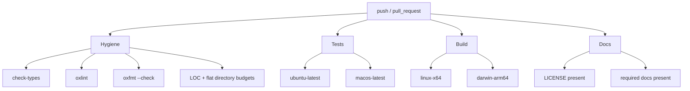

# CI

CI is intentionally broad: it checks static correctness, formatting, budgets, tests, builds, and documentation metadata in separate jobs so failures point at the responsible surface.

Every CI job activates Flox before running Bun commands. This keeps the CI toolchain aligned with local development and pre-commit.

## Jobs

| Job               | Purpose                                      | Main commands                                                                   |
| ----------------- | -------------------------------------------- | ------------------------------------------------------------------------------- |
| Hygiene           | Fast correctness and repository policy       | `bun run check-types`, `bun run lint`, `bun run format:check`, `bun run budget` |
| Tests             | Runtime behavior on supported developer OSes | `bun run test` on Ubuntu and macOS                                              |
| Build             | Binary smoke builds                          | `bun run build linux-x64`, `bun run build darwin-arm64`                         |
| Docs and Metadata | Required docs/license presence               | shell checks plus budget script                                                 |

## Flox Contract

The checked-in `.flox/env/manifest.toml` installs Bun, Node, Git, GitHub CLI, and pre-commit. CI uses `flox activate -- <command>` rather than assuming runner-global tools.

## Budget Gates

`bun run budget:file-sizes` fails if a tracked source, docs, script, workflow, JSON, TOML, or shell file exceeds 999 lines. Generated/build/dependency paths and assets are excluded.

`bun run budget:flat-dirs` fails if a directory has too many direct files. The current explicit exceptions are `test/`, where flat files map to behavior surfaces, and `src/themes/`, where each theme is a small standalone palette.
