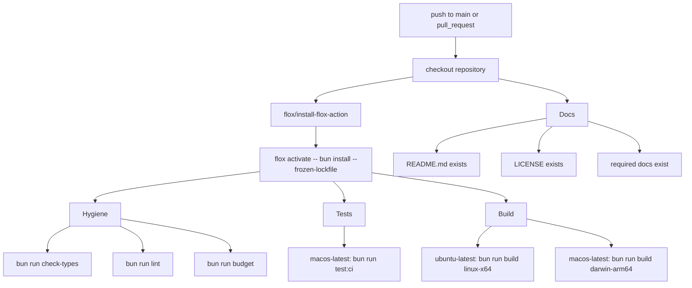
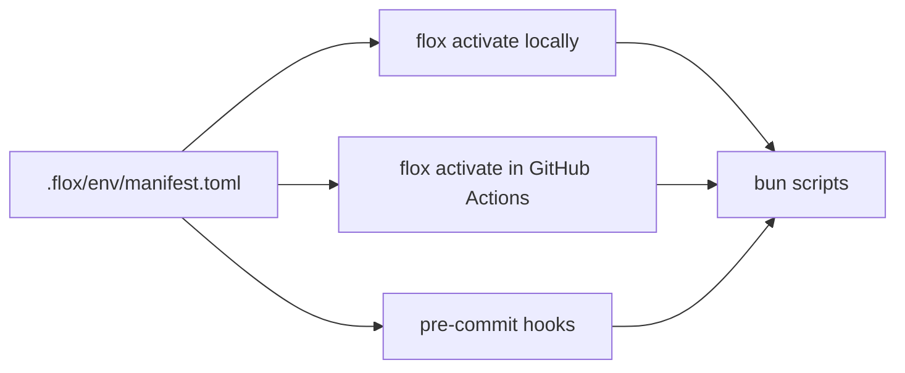
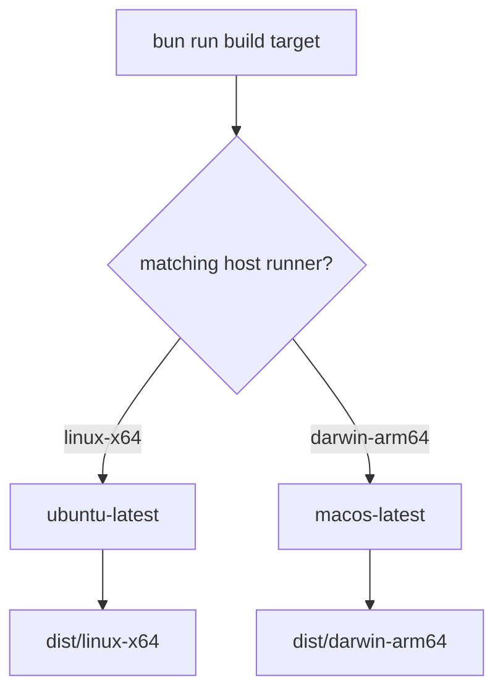

# CI

Continuous integration is intentionally broad. Dune is a terminal editor with native OpenTUI dependencies, parser integrations, release packaging, repository policy checks, and a Flox-managed toolchain. A narrow test-only workflow would miss too much. The CI design separates fast hygiene checks, runtime tests, platform builds, and documentation metadata so failures point at the surface that needs attention.

## Workflow Summary

All Bun commands in CI run through `flox activate -- ...`. This is the contract that keeps local development, pre-commit, and hosted runners aligned.

## Jobs

| Job | Runner | Purpose | Commands |
| --- | --- | --- | --- |
| `Hygiene` | `ubuntu-latest` | Static correctness and repository policy | `bun run check-types`, `bun run lint`, `bun run budget` |
| `Tests` | `macos-latest` | Runtime behavior using the OpenTUI/Solid test harness | `bun run test:ci` |
| `Build (linux-x64)` | `ubuntu-latest` | Linux binary smoke build | `bun run build linux-x64` |
| `Build (darwin-arm64)` | `macos-latest` | Apple Silicon binary smoke build | `bun run build darwin-arm64` |
| `Docs and Metadata` | `ubuntu-latest` | Required repository documentation and license presence | shell `test -s` checks |

The workflow uses `fail-fast: false` for matrixed jobs where seeing all platform results is more useful than stopping at the first failure.

## Flox Contract

Flox is the source of the CI toolchain. The checked-in environment installs:

| Tool | Purpose |
| --- | --- |
| Bun | Runtime, package manager, test runner, script runner, and build entry point |
| Node.js | Compatibility for TypeScript tooling and release ecosystem commands |
| Git | Source metadata, release tagging, and local developer workflow |
| GitHub CLI | Release and repository automation support |
| pre-commit | Local hook runner that mirrors repository checks |

Do not add CI steps that depend on runner-global installations when the tool can reasonably be installed through Flox. Runner-global tools change without review. Flox changes are checked into the repository and reviewed like code.

## Hygiene Gate

The hygiene job is designed to fail quickly on issues that do not require rendering the terminal application.

`bun run check-types` runs TypeScript in no-emit mode. It catches invalid module boundaries, stale types, broken prop contracts, and API mismatches.

`bun run lint` runs Oxlint. It catches common correctness and maintainability issues. Warnings are allowed where the configured linter reports them without failing; errors must be fixed.

`bun run budget` runs both repository budget scripts:

| Script | Enforces |
| --- | --- |
| `scripts/check-file-sizes.ts` | Every tracked source/doc/script/workflow/config file stays at or below 999 lines, excluding generated or binary paths. |
| `scripts/check-flat-directories.ts` | Direct file counts stay below the default directory budget unless a documented exception exists. |

## Test Gate

The test job runs `bun run test:ci`, which maps to non-parallel `bun test`. The non-parallel CI command is deliberate: OpenTUI integration tests exercise terminal-renderer behavior and filesystem workflows, and deterministic hosted output is more valuable than shaving a small amount of time from the run.

Tests currently run on macOS in CI because the OpenTUI interaction harness is stable there for the full behavior suite. Linux remains covered through typechecking, linting, budgets, and binary build smoke tests. If the Linux interaction harness becomes stable, add Ubuntu back to the test matrix and document the change here in the same commit.

## Build Gate

Build jobs verify that platform-specific optional OpenTUI packages resolve correctly on the corresponding host runner. Cross-compiling from one host is not sufficient because optional native packages are installed according to the host platform during `bun install`.

Local builds can still use `bun run build` for the host platform. For target-specific verification, prefer the CI matrix because it installs dependencies on the target host family.

## Docs And Metadata Gate

The docs job checks that the repository has the required public-facing documentation set:

| File | Role |
| --- | --- |
| `README.md` | First entry point for users and contributors |
| `LICENSE` | Exact project license |
| `docs/architecture.md` | Runtime shape, boundaries, and maintenance rules |
| `docs/ci.md` | Hosted CI, Flox, and repository gates |
| `docs/development.md` | Local development workflow |
| `docs/testing.md` | Test strategy and commands |
| `docs/releasing.md` | Release sequence and package publication rules |

The docs job intentionally starts with presence checks. More semantic documentation checks can be added later, but they should not replace human review. Diagrams and prose still need reviewers to confirm that they describe reality.

## Formatting Note

Formatting is available locally through `bun run format` and `bun run format:check`. Hosted CI currently does not gate on `format:check` because formatter behavior was observed to drift on hosted runners even with the pinned config. Keep using the local formatter before commits. If formatter behavior becomes stable in GitHub Actions, reintroduce the CI formatting gate and update this document.

## Failure Triage

Use the failing job to choose the first investigation path:

| Failing job | First checks |
| --- | --- |
| Hygiene | Run the exact failing command inside `flox activate`; inspect type errors, lint errors, or budget output. |
| Tests | Re-run `bun run test:ci`; if needed, run the single failing `test/*.test.tsx` file. |
| Build | Check target-specific optional dependencies and whether the build target matches the runner host. |
| Docs and Metadata | Confirm required docs exist and are non-empty. |

Do not broaden a CI workaround without documenting why. If a gate is temporarily narrowed because of an upstream or hosted-runner issue, record the issue here and keep coverage elsewhere.
