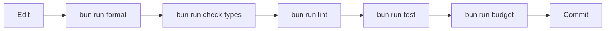

# Development

Development should happen inside Flox unless you are deliberately testing host-machine behavior.

```bash
flox activate
bun install
```

## Daily Loop



## Commands

| Task                          | Command                |
| ----------------------------- | ---------------------- |
| Activate toolchain            | `flox activate`        |
| Install dependencies          | `bun install`          |
| Run from source               | `bun run start .`      |
| Build host binary             | `bun run build`        |
| Type check                    | `bun run check-types`  |
| Lint                          | `bun run lint`         |
| Format                        | `bun run format`       |
| Format check                  | `bun run format:check` |
| Test                          | `bun run test`         |
| LOC budgets                   | `bun run budget`       |
| Full CI-equivalent local gate | `bun run ci`           |

Use `bun run <script>`. Do not use npm or pnpm for dependency installation; `bun.lock` is the lockfile.

## Pre-commit

```bash
pre-commit install
pre-commit run --all-files
```

Pre-commit runs through Flox, so hooks use the same Bun and tools as CI.
