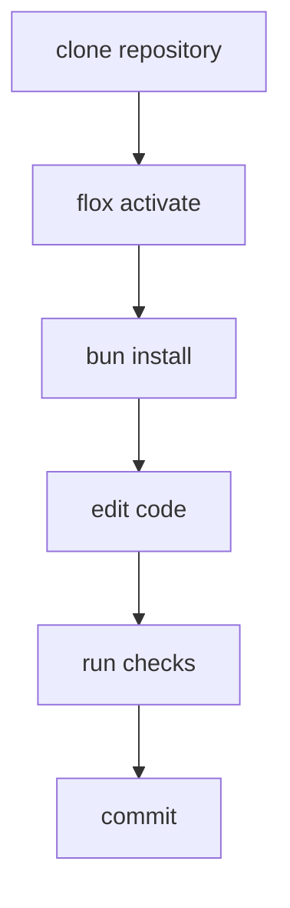
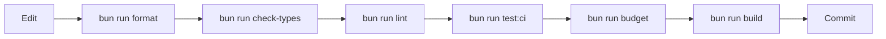
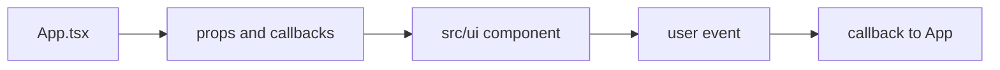
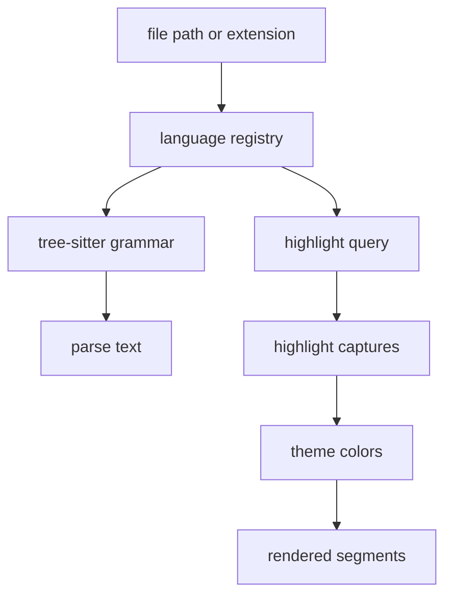
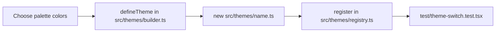

# Development

This document describes the expected local workflow for working on Dune. The short version is: activate Flox, use Bun, run the same checks CI runs, and keep files small enough that review remains practical.

## Environment Setup

Development should happen inside Flox unless you are deliberately testing host-machine behavior.

```bash
flox activate
bun install
```

The Flox activation hook prepends `node_modules/.bin` to `PATH` and prints the active Bun version. That makes local commands behave like CI commands without relying on tools installed somewhere else on the machine.



## Tooling Rules

| Tool       | Use                                                                   |
| ---------- | --------------------------------------------------------------------- |
| Flox       | Provides the reviewed development toolchain.                          |
| Bun        | Installs dependencies, runs scripts, runs tests, and builds binaries. |
| TypeScript | Typechecks the source with `tsc --noEmit`.                            |
| Oxlint     | Lints TypeScript and TSX files.                                       |
| Oxfmt      | Formats source locally.                                               |
| pre-commit | Runs repository hooks before commits.                                 |

Use `bun install`, not npm or pnpm. `bun.lock` is the lockfile.

Use `bun run <script>`, not direct tool invocations, unless you are debugging the tool itself. Package scripts are the stable interface that docs, CI, and pre-commit share.

## Daily Loop



For small documentation-only changes, the full build may not be necessary, but `bun run budget` still matters because docs are covered by the line budget.

## Commands

| Task                            | Command                                                   |
| ------------------------------- | --------------------------------------------------------- |
| Activate toolchain              | `flox activate`                                           |
| Install dependencies            | `bun install`                                             |
| Run from source                 | `bun run start .`                                         |
| Run in watch mode               | `bun run dev .`                                           |
| Build host binary               | `bun run build`                                           |
| Build target binary             | `bun run build linux-x64` or `bun run build darwin-arm64` |
| Type check                      | `bun run check-types`                                     |
| Lint                            | `bun run lint`                                            |
| Lint and apply fixes            | `bun run lint:fix`                                        |
| Format                          | `bun run format`                                          |
| Format check                    | `bun run format:check`                                    |
| Run parallel tests              | `bun run test`                                            |
| Run CI-style tests              | `bun run test:ci`                                         |
| Watch tests                     | `bun run test:watch`                                      |
| Check LOC and directory budgets | `bun run budget`                                          |
| Full local CI-style gate        | `bun run ci`                                              |

## Pre-commit

Install hooks once:

```bash
pre-commit install
```

Run all hooks manually:

```bash
pre-commit run --all-files
```

Pre-commit runs through Flox, so hooks use the same Bun and repository tooling as CI. If a hook fails, fix the underlying issue instead of bypassing the hook. Hook bypasses are only appropriate for emergency commits that will immediately be repaired.

## Working On App State

App-level changes usually touch `src/app/App.tsx` and one or more helpers under `src/app`. Keep the top-level app file focused on coordination:

| Put it in `App.tsx` when                             | Extract it when                                                            |
| ---------------------------------------------------- | -------------------------------------------------------------------------- |
| The logic coordinates multiple state owners.         | The logic is pure or mostly pure.                                          |
| The behavior is tied to Solid lifecycle and effects. | The behavior has a clear name and testable input/output.                   |
| The code decides which UI callback should run.       | The code builds prompt copy, resolves paths, or transforms search results. |

If `App.tsx` approaches the 500-line budget, extract by responsibility. Do not split a block merely to satisfy the counter.

## Working On UI Components

UI components in `src/ui` should receive state and callbacks through props. They may use OpenTUI and Solid primitives directly, but they should not reach into the app coordinator.



When a UI component needs reusable behavior, prefer `src/editor` for editor operations or `src/core` for process/file/search operations. Avoid making UI components responsible for filesystem policy.

## Working On Filesystem Features

Filesystem features need explicit error handling. A failed read, write, rename, delete, or stat should produce a user-visible result or a rejected operation that tests can observe.

For path-changing operations, update every path-bearing state owner:

| State            | Why it matters                                   |
| ---------------- | ------------------------------------------------ |
| Buffers          | Keeps open file contents mapped to the new path. |
| Tabs             | Prevents tabs from pointing at missing files.    |
| Active path      | Keeps editor focus correct.                      |
| Preview path     | Avoids stale preview state.                      |
| Tree selection   | Keeps keyboard navigation anchored.              |
| Expanded folders | Preserves the visible tree shape.                |
| Session data     | Makes restart restore the new paths.             |

## Working On Syntax Highlighting

Syntax highlighting relies on tree-sitter WASM grammars and query files. Changes can affect performance as well as correctness. Prefer small changes and targeted tests for language detection, parser selection, visible-window segmentation, and theme mapping.



Do not parse more than needed for rendering without measuring the cost. Terminal editors can feel slow from work that is invisible to the user.

## Working On Themes

Theme changes should preserve both chrome readability and syntax readability. The common
path for a new color scheme is:



Use `defineTheme()` for new palettes unless a theme needs unusually specific syntax
captures. It maps semantic colors to the full `ThemeUi` surface and the common
tree-sitter capture groups, which keeps additions small and makes contrast tests catch
the important mistakes.

Run `bun test test/theme-switch.test.tsx test/input.test.tsx test/unit.test.ts` after
theme changes. Those tests verify runtime repainting, syntax table replacement, stable UI
keys, current-line subtlety, and readable typed text in modal inputs.

## Budget Workflow

Run:

```bash
bun run budget
```

If the file-size budget fails:

1. Identify the responsibility that made the file grow.
2. Extract that responsibility into a named module.
3. Keep public types close to the boundary that owns them.
4. Add or update tests for the extracted behavior if it is not covered by existing integration tests.

If the flat-directory budget fails, prefer grouping by responsibility. A new folder should have a clear reason to exist, not just a desire to silence the budget script.

## Troubleshooting

| Symptom                                       | Likely cause                             | First action                                                   |
| --------------------------------------------- | ---------------------------------------- | -------------------------------------------------------------- |
| `bun` version differs from CI                 | Flox is not active                       | Run `flox activate`.                                           |
| Optional OpenTUI package missing for a target | Build target does not match host install | Use the matching CI runner or install on the target host.      |
| Tests write to real config                    | Test setup was bypassed                  | Check `test/setup.ts` and the failing test harness path.       |
| Keyboard shortcut triggers twice              | Overlay/focus guard is missing           | Inspect app-level key handling and editor key handling.        |
| Save overwrites external changes              | Conflict mtime check was skipped         | Follow the dirty/conflict lifecycle in `docs/architecture.md`. |
