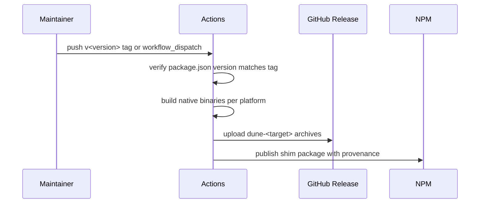

# Releasing

Releases publish a small npm shim and GitHub release archives containing the real binaries.



`package.json` is the version source. The release must upload binaries before npm publish because the npm package contains only launcher scripts that download from the GitHub release.

## Local Smoke

```bash
flox activate
bun install
bun run build
bun run release
```

## License

The repository uses the same license text as `dotbrains/hab`: PolyForm Shield License 1.0.0 with copyright assigned to dotbrains.
