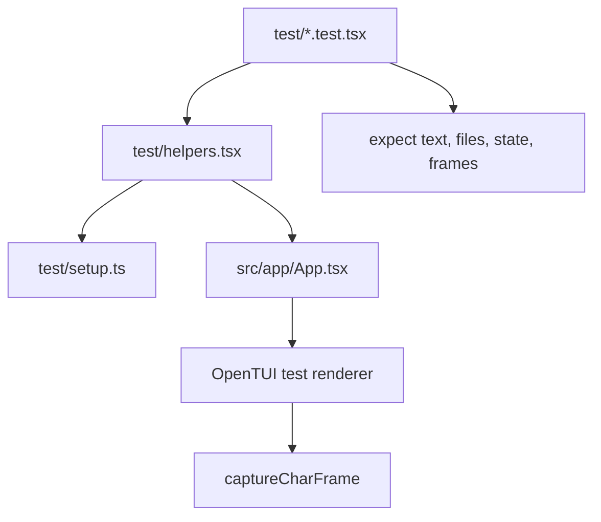
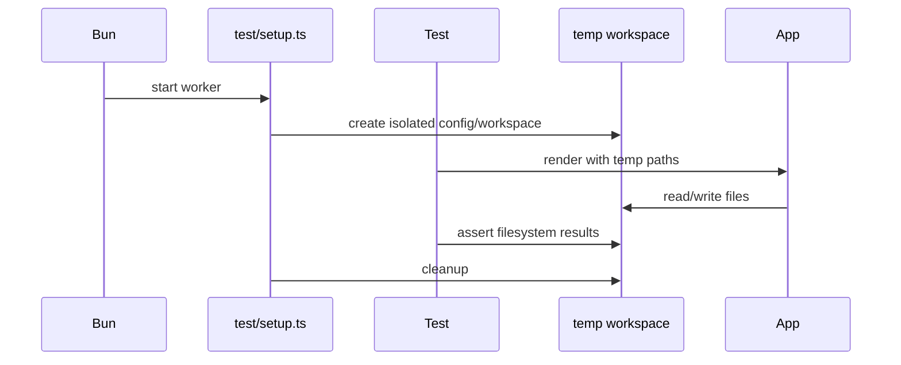
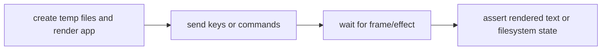

# Testing

Dune's test suite uses Bun and renders the real OpenTUI/Solid app off-screen. That is important: many terminal editor bugs are not pure function bugs. They show up when keyboard routing, focus ownership, tree state, modal overlays, filesystem state, editor content, and rendered frames interact.

## Test Architecture

Tests should exercise behavior at the highest useful boundary. For a user workflow, prefer rendering the app and sending keys. For pure text math, path transforms, search parsing, or history behavior, lower-level tests are appropriate.

## Commands

| Task | Command |
| --- | --- |
| Run CI-style tests | `bun run test:ci` |
| Run parallel local suite | `bun run test` |
| Run one test file | `bun test test/vim.test.tsx` |
| Watch tests | `bun run test:watch` |
| Run all local gates | `bun run ci` |

`bun run test` uses Bun's parallel mode. `bun run test:ci` runs the suite without parallelism because hosted CI should prioritize deterministic OpenTUI behavior over speed.

## Isolation

Each worker receives an isolated `XDG_CONFIG_HOME` from `test/setup.ts`. Tests should never write to the developer's real editor config, global session data, or arbitrary workspace files.

When adding tests that touch files, keep paths inside the helper-created workspace. Do not use absolute paths under the repository unless the test is read-only and intentionally inspecting fixtures.

## What To Test

| Area | Preferred coverage |
| --- | --- |
| File tree | Create, rename, delete, expansion, selection, hidden files, and path refresh behavior. |
| Editor | Typing, selection, cursor movement, scrolling, undo/redo, clipboard, and save behavior. |
| Modals | Focus trapping, confirm/cancel paths, prompt validation, and restoration of previous focus owner. |
| Search | Query parsing, result navigation, no-result state, replace behavior, and dirty-buffer interaction. |
| Git metadata | Status refresh, changed-line mapping, and graceful degradation outside git repositories. |
| Syntax highlighting | Language detection, parser/query mapping, visible-window segmentation, stale parse rejection, and theme colors. |
| Session restore | Tabs, active file, tree expansion, missing paths, and workspace-specific state. |
| Release scripts | Version checks, staged package shape, binary archive expectations, and failure paths. |

## Behavior Test Shape

Most behavior tests should follow this pattern:

Assertions should be user-visible when possible. A rendered frame assertion catches layout and focus bugs that a direct state assertion might miss. Filesystem assertions are appropriate for save, rename, delete, replace, and release-script workflows.

## Lower-Level Test Shape

Use lower-level tests when the behavior is pure or nearly pure:

| Module kind | Good lower-level assertions |
| --- | --- |
| Line/window math | Inputs produce stable visible ranges and cursor positions. |
| Typing/history | Operations produce expected text and undo/redo stacks. |
| Search parsing | Queries produce expected matcher behavior and replacement output. |
| Path rules | Relative and absolute paths normalize correctly. |
| Budget scripts | Fixtures pass and fail with useful messages. |

Lower-level tests should not duplicate full app tests. They should make edge cases cheap to cover.

## CI Platform Notes

The full OpenTUI interaction suite runs on macOS in GitHub Actions. Linux is covered by typechecking, linting, budgets, and binary builds. If Linux interaction tests are added back to CI, verify that the OpenTUI harness is stable on hosted Ubuntu and update `docs/ci.md` at the same time.

## Debugging Failing Tests

| Symptom | First action |
| --- | --- |
| Frame text is missing | Capture and inspect the rendered frame around the expected text. |
| A keypress seems ignored | Check which focus owner is active and whether an overlay is open. |
| A file assertion fails | Print the temp workspace tree or inspect the helper-created paths. |
| A test passes alone but fails in suite | Look for leaked timers, global config, shared temp paths, or renderer cleanup. |
| CI fails but local passes | Re-run `bun run test:ci` inside Flox and compare platform-specific assumptions. |

Keep test fixes focused. If a test exposes a real user-facing race, fix the race instead of adding arbitrary sleeps.
