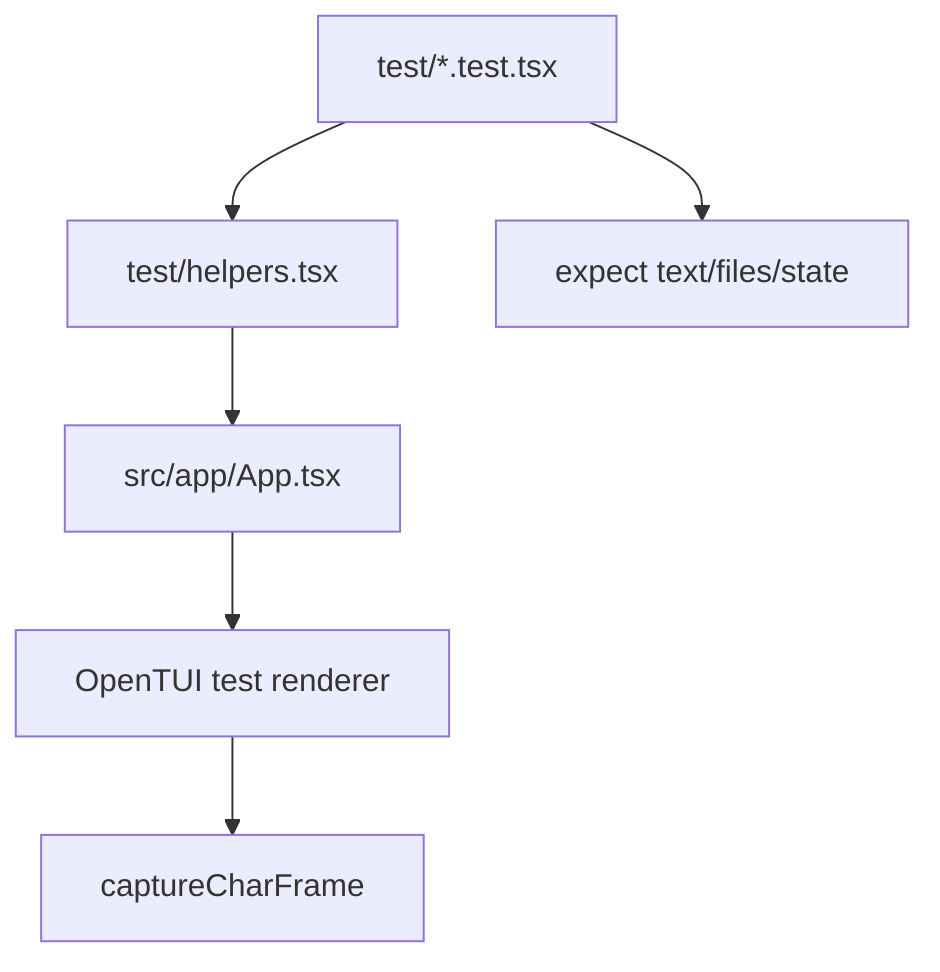

# Testing

The test suite uses Bun and renders the real OpenTUI/Solid app off-screen. This catches terminal layout, keyboard routing, modal focus, file-tree behavior, syntax rendering, and filesystem interactions that type checks cannot see.



## Running Tests

```bash
bun run test
bun test test/vim.test.tsx
```

The full suite runs with `--parallel`. Each worker receives an isolated `XDG_CONFIG_HOME` from `test/setup.ts`, so tests do not write to the developer's real config.

## Test Style

Prefer behavior tests at the app boundary for user-visible workflows. Use lower-level unit tests for pure text operations, search parsing, highlighting segmentation, and git/change mapping.
